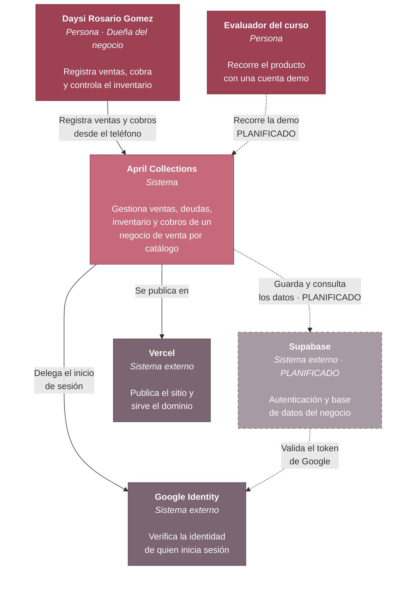
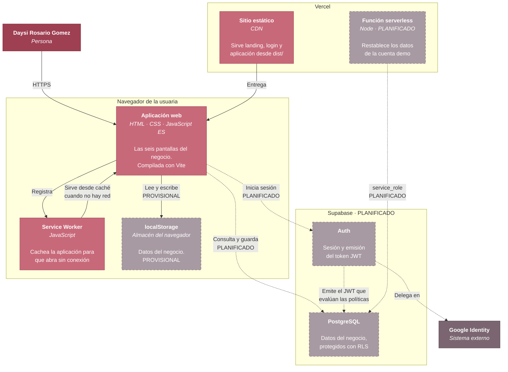
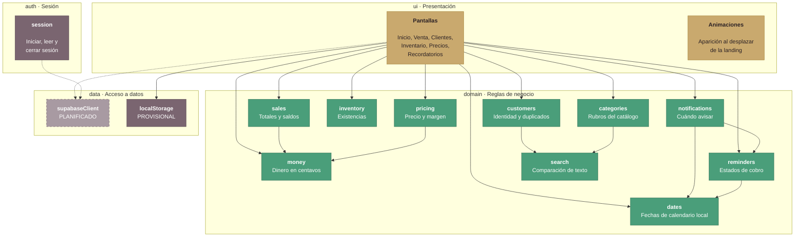

# Arquitectura

Diagramas del sistema en tres niveles de zoom, según el modelo C4 de Simon
Brown. Están escritos en Mermaid, así que GitHub los dibuja directamente y se
versionan como texto: un cambio de arquitectura se revisa en un diff, no
comparando capturas de pantalla.

| Nivel | Pregunta que responde |
|-------|----------------------|
| [1 · Contexto](#nivel-1--contexto-del-sistema) | ¿Quién usa el sistema y con qué se habla? |
| [2 · Contenedores](#nivel-2--contenedores) | ¿De qué piezas ejecutables se compone? |
| [3 · Componentes](#nivel-3--componentes-de-la-aplicación-web) | ¿Cómo está organizado el código por dentro? |

## Cómo leer el estado de cada elemento

Los diagramas distinguen lo que ya existe de lo que está planificado. Eso es
deliberado: un diagrama que muestra la arquitectura soñada como si estuviera
construida no sirve para tomar decisiones.

| Marca | Significado |
|-------|-------------|
| **Implementado** | Funciona hoy y está en el repositorio |
| **Planificado** | Decidido y documentado en un ADR, todavía sin construir |

## Decisiones relacionadas

- [ADR-0001](adr/0001-autenticacion-con-google-via-supabase.md) — Autenticación con Google
- [ADR-0002](adr/0002-estrategia-de-notificaciones.md) — Estrategia de notificaciones
- [ADR-0003](adr/0003-acceso-demo-con-credenciales-propias.md) — Acceso demo con credenciales propias

---

## Nivel 1 · Contexto del sistema

Quién usa April Collections y con qué sistemas externos se relaciona.

### Actores

| Actor | Qué hace | Estado |
|---|---|---|
| **Daysi Rosario Gomez** | Usuaria real. Administra el negocio desde el teléfono: registra ventas, agenda cobros y controla existencias. | Activo |
| **Evaluador del curso** | Recorre el producto con una cuenta de demostración, sin tocar datos reales del negocio. | Planificado (Etapa 10) |

### Sistemas externos

| Sistema | Para qué | Estado |
|---|---|---|
| **Google Identity** | Proveedor de identidad. La aplicación no almacena ni valida contraseñas: no puede filtrar lo que no guarda. Ver [ADR-0001](adr/0001-autenticacion-con-google-via-supabase.md). | Implementado, pendiente de configurar |
| **Supabase** | Base de datos del negocio y emisor del token que consumen las políticas RLS. | Planificado (Etapa 3) |
| **Vercel** | Publica el sitio y sirve el dominio propio. | Implementado |

### Lo que este nivel deja claro

**El sistema no guarda contraseñas.** La identidad la garantiza Google; April
Collections solo recibe un token ya verificado.

**Hoy los datos no salen del navegador.** Mientras Supabase no esté conectado,
todo vive en `localStorage` del dispositivo. Es la limitación que motiva la
Etapa 3 y la razón por la que el negocio todavía no puede usarse desde dos
teléfonos.

---

## Nivel 2 · Contenedores

Las piezas ejecutables que componen April Collections y cómo se comunican.

### Contenedores

| Contenedor | Tecnología | Responsabilidad | Estado |
|---|---|---|---|
| **Aplicación web** | HTML, CSS y módulos ES compilados con Vite | Las seis pantallas del negocio y toda la lógica de dominio | Implementado |
| **Service Worker** | JavaScript propio | Cachear el envoltorio para que la aplicación abra sin conexión | Implementado (Etapa 6) |
| **localStorage** | Almacén del navegador | Guardar los datos del negocio | **Provisional** |
| **Sitio estático** | CDN de Vercel | Servir `dist/` en el dominio propio | Implementado |
| **Función serverless** | Node en Vercel | Restablecer la cuenta demo con la `service_role` key, que no puede viajar al navegador | Planificado (Etapa 10) |
| **Supabase Auth** | Servicio gestionado | Sesión y emisión del JWT | Planificado (Etapa 4) |
| **PostgreSQL** | Servicio gestionado | Datos del negocio con políticas RLS por dueño | Planificado (Etapa 3) |

### Dos decisiones que este nivel explica

**No hay servidor propio de aplicación.** El frontend habla directamente con
Supabase, que evalúa las políticas RLS del lado del servidor contra el usuario
autenticado. Añadir una capa intermedia sería complejidad sin beneficio: la
autorización ya se decide donde están los datos.

**La única función serverless prevista existe por una razón concreta.**
Restablecer la cuenta demo requiere la `service_role` key, que ignora todas las
políticas RLS y por tanto no puede estar en el navegador bajo ninguna
circunstancia. Ese código tiene que ejecutarse en el servidor. No se prevén
más funciones: el CRUD no las necesita.

**`localStorage` está marcado como provisional, no como diseño.** Es lo que hay
hoy y funciona para un dispositivo, pero significa que los datos no se comparten
entre teléfonos y se pierden al limpiar el navegador. La Etapa 3 lo convierte en
caché de Supabase, no en la fuente de verdad.

---

## Nivel 3 · Componentes de la aplicación web

Cómo está organizado el código dentro del contenedor «Aplicación web».

### La regla que sostiene el diseño

**`domain/` no importa nada de `ui/`, de `data/` ni del navegador.** Las flechas
del diagrama solo entran al dominio; ninguna sale hacia arriba.

Esa restricción no es estética. Tiene tres consecuencias medibles:

1. **Se prueba sin simular un navegador.** Las pruebas corren en Node, sin DOM
   ni mocks. Por eso la capa está al 100 % de líneas y funciones con pruebas
   que verifican reglas reales, no cobertura inflada.
2. **Las reglas están en un solo sitio.** Antes, el cálculo del saldo pendiente
   aparecía repetido en siete lugares de `app.html`, cada uno con su propia
   tolerancia de céntimos.
3. **Cambiar de almacenamiento no toca las reglas.** Al migrar de
   `localStorage` a Supabase, `domain/` no se modifica.

### Componentes del dominio

| Módulo | Responsabilidad | Decisión que fija |
|---|---|---|
| `money` | Dinero en centavos enteros | Elimina el error de coma flotante y la tolerancia de `0.01` repetida ocho veces |
| `dates` | Fechas de calendario local | Corrige dos errores de zona horaria: ventas del día 1 contadas en el mes anterior, y el día cambiando a las 18:00 |
| `pricing` | Precio desde margen y su inversa | El margen no puede ser negativo |
| `sales` | Total, saldo, ganancia, forma de pago | El saldo nunca es negativo; la ganancia se reconoce al vender, no al cobrar |
| `inventory` | Existencias y movimientos | Vender exige stock suficiente; el ajuste manual sí recorta en cero |
| `reminders` | Estados y vencimiento | Al saldarse una venta, sus recordatorios se cierran solos |
| `notifications` | Cuándo avisar de un cobro | Avisa 30 min antes e insiste hasta que la usuaria lo atiende |
| `customers` | Identidad y duplicados | DNI opcional, pero validado y único cuando se escribe |
| `categories` | Rubros del catálogo | No admite repetidos ignorando tildes; no se borra una categoría en uso |
| `search` | Comparación de texto | Ignora mayúsculas y tildes: se teclea con prisa desde el teléfono |

### Deuda declarada

`app.html` todavía usa atributos `onclick` en el HTML. Como su script es un
módulo y no comparte el ámbito global, hay un bloque `Object.assign(window, …)`
que expone las funciones que el HTML invoca, y una prueba
([tests/app-handlers.test.js](../tests/app-handlers.test.js)) que falla si
ambas listas se separan.

Ese bloque se reduce cada vez que un control migra a `addEventListener`. Cuando
llegue a cero podrá activarse la Content-Security-Policy estricta, que prohíbe
el código en línea.
