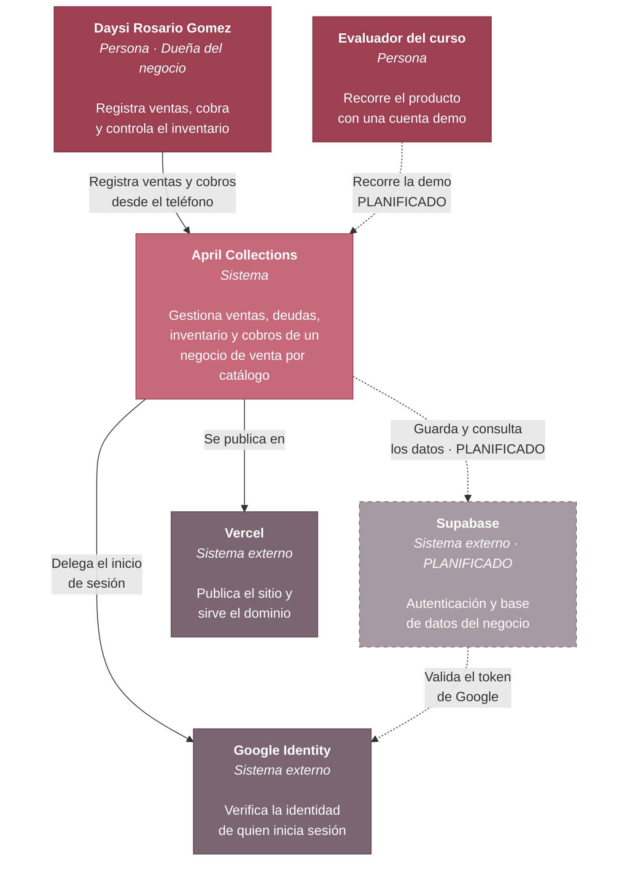

# C4 · Nivel 1 — Contexto del sistema

Quién usa April Collections y con qué sistemas externos se relaciona.

## Actores

| Actor | Qué hace | Estado |
|---|---|---|
| **Daysi Rosario Gomez** | Usuaria real. Administra el negocio desde el teléfono: registra ventas, agenda cobros y controla existencias. | Activo |
| **Evaluador del curso** | Recorre el producto con una cuenta de demostración, sin tocar datos reales del negocio. | Planificado (Etapa 10) |

## Sistemas externos

| Sistema | Para qué | Estado |
|---|---|---|
| **Google Identity** | Proveedor de identidad. La aplicación no almacena ni valida contraseñas: no puede filtrar lo que no guarda. Ver [ADR-0001](../adr/0001-autenticacion-con-google-via-supabase.md). | Implementado, pendiente de configurar |
| **Supabase** | Base de datos del negocio y emisor del token que consumen las políticas RLS. | Planificado (Etapa 3) |
| **Vercel** | Publica el sitio y sirve el dominio propio. | Implementado |

## Lo que este nivel deja claro

**El sistema no guarda contraseñas.** La identidad la garantiza Google; April
Collections solo recibe un token ya verificado.

**Hoy los datos no salen del navegador.** Mientras Supabase no esté conectado,
todo vive en `localStorage` del dispositivo. Es la limitación que motiva la
Etapa 3 y la razón por la que el negocio todavía no puede usarse desde dos
teléfonos.
