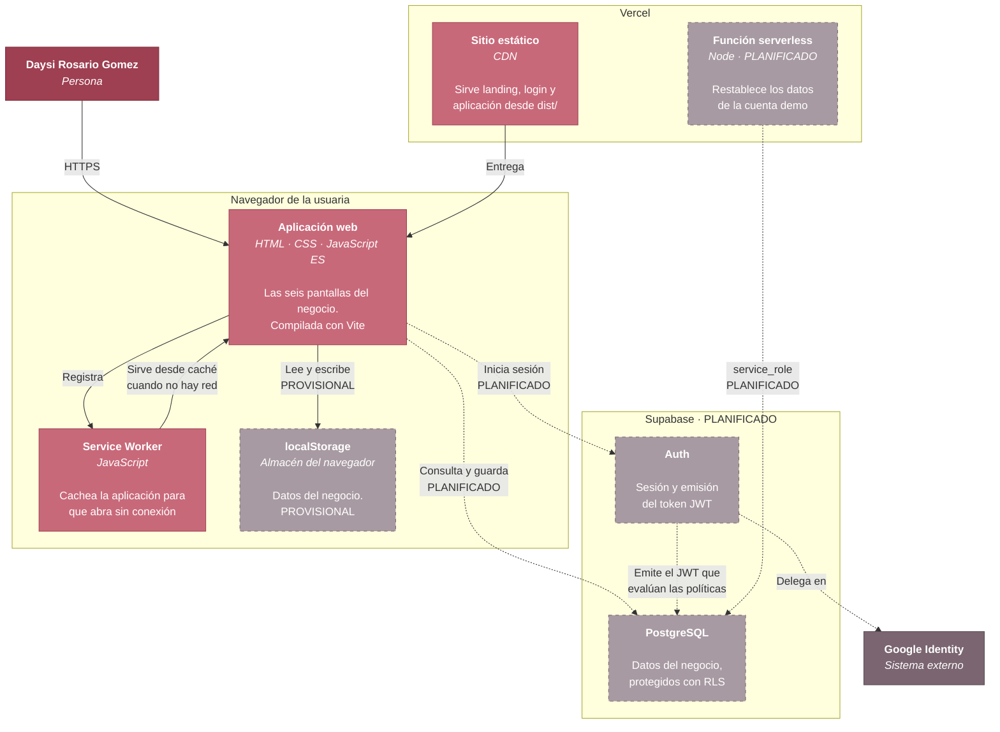

# C4 · Nivel 2 — Contenedores

Las piezas ejecutables que componen April Collections y cómo se comunican.

## Contenedores

| Contenedor | Tecnología | Responsabilidad | Estado |
|---|---|---|---|
| **Aplicación web** | HTML, CSS y módulos ES compilados con Vite | Las seis pantallas del negocio y toda la lógica de dominio | Implementado |
| **Service Worker** | JavaScript propio | Cachear el envoltorio para que la aplicación abra sin conexión | Implementado (Etapa 6) |
| **localStorage** | Almacén del navegador | Guardar los datos del negocio | **Provisional** |
| **Sitio estático** | CDN de Vercel | Servir `dist/` en el dominio propio | Implementado |
| **Función serverless** | Node en Vercel | Restablecer la cuenta demo con la `service_role` key, que no puede viajar al navegador | Planificado (Etapa 10) |
| **Supabase Auth** | Servicio gestionado | Sesión y emisión del JWT | Planificado (Etapa 4) |
| **PostgreSQL** | Servicio gestionado | Datos del negocio con políticas RLS por dueño | Planificado (Etapa 3) |

## Dos decisiones que este nivel explica

**No hay servidor propio de aplicación.** El frontend habla directamente con
Supabase, que evalúa las políticas RLS del lado del servidor contra el usuario
autenticado. Añadir una capa intermedia sería complejidad sin beneficio: la
autorización ya se decide donde están los datos.

**La única función serverless prevista existe por una razón concreta.**
Restablecer la cuenta demo requiere la `service_role` key, que ignora todas las
políticas RLS y por tanto no puede estar en el navegador bajo ninguna
circunstancia. Ese código tiene que ejecutarse en el servidor. No se prevén
más funciones: el CRUD no las necesita.

**`localStorage` está marcado como provisional, no como diseño.** Es lo que hay
hoy y funciona para un dispositivo, pero significa que los datos no se comparten
entre teléfonos y se pierden al limpiar el navegador. La Etapa 3 lo convierte en
caché de Supabase, no en la fuente de verdad.
