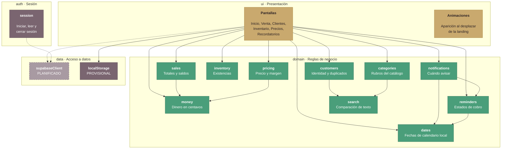

# C4 · Nivel 3 — Componentes de la aplicación web

Cómo está organizado el código dentro del contenedor «Aplicación web».

## La regla que sostiene el diseño

**`domain/` no importa nada de `ui/`, de `data/` ni del navegador.** Las flechas
del diagrama solo entran al dominio; ninguna sale hacia arriba.

Esa restricción no es estética. Tiene tres consecuencias medibles:

1. **Se prueba sin simular un navegador.** Las pruebas corren en Node, sin DOM
   ni mocks. Por eso la capa está al 100 % de líneas y funciones con pruebas
   que verifican reglas reales, no cobertura inflada.
2. **Las reglas están en un solo sitio.** Antes, el cálculo del saldo pendiente
   aparecía repetido en siete lugares de `app.html`, cada uno con su propia
   tolerancia de céntimos.
3. **Cambiar de almacenamiento no toca las reglas.** Al migrar de
   `localStorage` a Supabase, `domain/` no se modifica.

## Componentes del dominio

| Módulo | Responsabilidad | Decisión que fija |
|---|---|---|
| `money` | Dinero en centavos enteros | Elimina el error de coma flotante y la tolerancia de `0.01` repetida ocho veces |
| `dates` | Fechas de calendario local | Corrige dos errores de zona horaria: ventas del día 1 contadas en el mes anterior, y el día cambiando a las 18:00 |
| `pricing` | Precio desde margen y su inversa | El margen no puede ser negativo |
| `sales` | Total, saldo, ganancia, forma de pago | El saldo nunca es negativo; la ganancia se reconoce al vender, no al cobrar |
| `inventory` | Existencias y movimientos | Vender exige stock suficiente; el ajuste manual sí recorta en cero |
| `reminders` | Estados y vencimiento | Al saldarse una venta, sus recordatorios se cierran solos |
| `notifications` | Cuándo avisar de un cobro | Avisa 30 min antes e insiste hasta que la usuaria lo atiende |
| `customers` | Identidad y duplicados | DNI opcional, pero validado y único cuando se escribe |
| `categories` | Rubros del catálogo | No admite repetidos ignorando tildes; no se borra una categoría en uso |
| `search` | Comparación de texto | Ignora mayúsculas y tildes: se teclea con prisa desde el teléfono |

## Deuda declarada

`app.html` todavía usa atributos `onclick` en el HTML. Como su script es un
módulo y no comparte el ámbito global, hay un bloque `Object.assign(window, …)`
que expone las funciones que el HTML invoca, y una prueba
([tests/app-handlers.test.js](../../tests/app-handlers.test.js)) que falla si
ambas listas se separan.

Ese bloque se reduce cada vez que un control migra a `addEventListener`. Cuando
llegue a cero podrá activarse la Content-Security-Policy estricta, que prohíbe
el código en línea.
