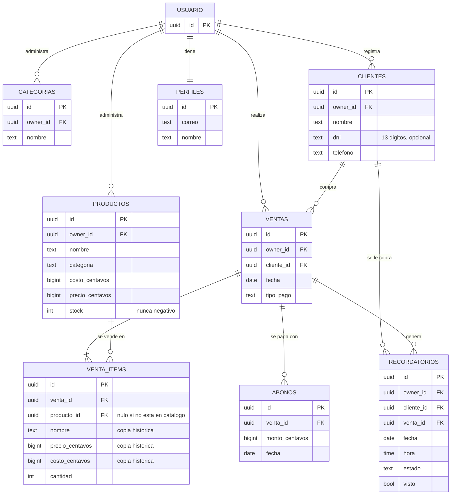

# Modelo de datos

| Archivo | Qué es |
|---|---|
| [modelo.json](modelo.json) | El modelo exportado en JSON: entidades, campos, relaciones y políticas, con el motivo de cada decisión |
| [`0001_esquema_inicial.sql`](../../supabase/migrations/0001_esquema_inicial.sql) | Tablas, restricciones, índices y la vista de saldos |
| [`0002_politicas_rls.sql`](../../supabase/migrations/0002_politicas_rls.sql) | Políticas RLS y alta automática del perfil |

> **Estado:** el esquema está definido pero **todavía no aplicado**. El proyecto
> de Supabase no ha sido creado, así que la aplicación sigue guardando en
> `localStorage`. Migrar esos datos es parte de la Etapa 3.

## Diagrama entidad-relación



## Las cinco decisiones que hay que poder defender

**1. El dinero se guarda en centavos enteros, no en decimales.**
Con `numeric` o `float`, un total repartido en abonos parciales acumula error y
una deuda saldada queda con fracciones pendientes. Es la misma decisión que
`src/domain/money.js`, y por eso el código de dominio y la base hablan el mismo
idioma sin conversiones.

**2. El total de una venta no se guarda: se calcula.**
Es la suma de sus líneas. Guardarlo abriría la puerta a que quedara
desincronizado con ellas. La vista `ventas_con_saldo` lo calcula una sola vez,
en lugar de repetir la fórmula en cada consulta — que es justamente el problema
que tenía la versión anterior, con el saldo pendiente duplicado en siete sitios.

**3. Las líneas de venta copian nombre, precio y costo.**
No es redundancia: es el **valor histórico**. Si mañana sube el costo del
producto, la ganancia de las ventas viejas no debe cambiar. Por eso
`producto_id` puede además quedar en `NULL` sin romper nada.

**4. Las fechas de calendario son `date`, no `timestamptz`.**
«El 1 de agosto» no tiene hora ni zona. Guardarlas con zona reintroduce
exactamente el error que corrigió `src/domain/dates.js`: ventas del día 1
contadas en el mes anterior.

**5. `venta_items` y `abonos` no llevan `owner_id`.**
Pertenecen a una venta, y la venta ya tiene dueño. Duplicar la columna
permitiría que una línea acabara con un dueño distinto al de su venta. El
precio es que su política RLS comprueba la pertenencia con un `EXISTS` sobre
`ventas`; se prefiere pagar eso antes que arriesgar datos incoherentes.

## Seguridad

**RLS es la barrera real.** El guard del cliente y ocultar botones son comodidad
de interfaz: se saltan desactivando JavaScript. Postgres evalúa estas políticas
en el servidor, en cada consulta, contra el JWT que emite Supabase Auth.

Sin RLS activo, la `anon key` —que es pública por diseño— permitiría a
cualquiera leer la base entera. Por eso se habilita en **todas** las tablas.

Dos detalles que suelen olvidarse y aquí están cubiertos:

- Cada política define `USING` **y** `WITH CHECK`. `USING` filtra lo que se
  puede leer o afectar; `WITH CHECK` valida lo que se intenta escribir. Sin lo
  segundo, alguien podría insertar una fila con el `owner_id` de otra persona.
- La vista se declara con `security_invoker = on`. Por defecto una vista se
  evalúa con los permisos de quien la creó, lo que aquí sería una fuga:
  cualquiera vería los saldos de todas las usuarias.

## Cómo aplicarlo

Cuando el proyecto de Supabase exista, en el **SQL Editor** del panel, en orden:

1. `supabase/migrations/0001_esquema_inicial.sql`
2. `supabase/migrations/0002_politicas_rls.sql`

Para comprobar que RLS quedó activo, en el SQL Editor:

```sql
select tablename, rowsecurity
from pg_tables
where schemaname = 'public';
```

Todas las filas deben mostrar `rowsecurity = true`.
